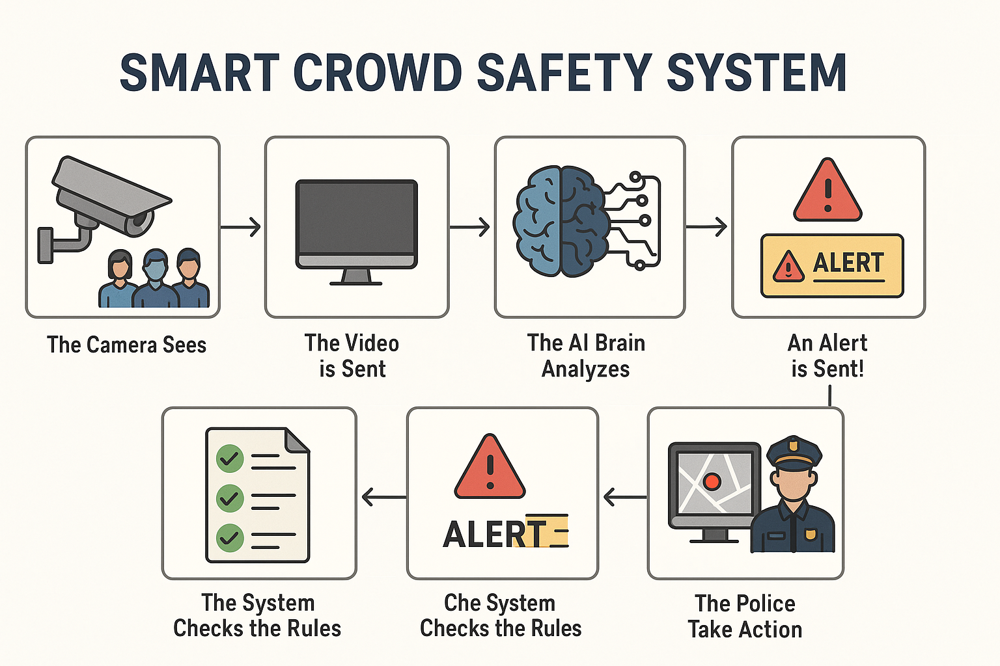

# 🚨 AI Crowd Management System – Smart Crowd Safety

### 📡 Real-Time Overcrowding Detection & Instant Alerts via CCTV + AI

---

## 📘 Overview

The **AI Crowd Management System** is a real-time video analytics solution that integrates with existing CCTV infrastructure to detect **overcrowding** in public spaces. It sends instant alerts to security authorities, helping them **prevent stampedes**, **divert foot traffic**, and **save lives**—all without manual monitoring.

---

## 🎯 Problem Statement

Managing crowds in real-time is difficult:

- 🚶‍♂️ Thousands gather during festivals, rallies, or sports events.
- 👁️ Control rooms can't monitor 20+ camera feeds efficiently.
- 🕑 By the time someone notices a critical crowd situation—it's already late.

**We solve this** using AI to analyze camera feeds 24/7, detect when a crowd becomes dense, and alert the right people instantly.

---

## 💡 Our AI-Powered Solution

✅ **Monitors crowd density** using AI on live CCTV video  
✅ **Counts or estimates** the number of people in defined zones  
✅ **Compares** crowd levels to safety thresholds  
✅ **Sends real-time alerts** (dashboard, email, SMS, push)  
✅ **Visualizes danger zones** on an interactive map

---

## 🧠 System Workflow

1. 🎥 CCTV Camera captures video in public zones  
2. 📡 Video stream sent via RTSP to AI server  
3. 🧠 AI Engine processes frames:
   - 👥 **Object Detection** for light crowds (YOLOv8, SSD)
   - 🌈 **Density Estimation** for heavy crowds (CNN Heatmaps)
4. 📏 Rule Engine checks thresholds per zone  
5. 🚨 Alert triggered if threshold is breached  
6. 🧑‍✈️ Authorities receive real-time alert on web dashboard  
7. 🧭 Action is taken (reroute crowd, dispatch officers, etc.)

---

## 🧭 System Architecture Diagram

> 

📌 **Legend**:
- 🎥 Cameras ➜ 🧠 AI Model ➜ 📏 Logic Hub ➜ 📺 Dashboard ➜ 🚔 Human Action  
- Edge or cloud-based AI engine handles live processing with alert triggers

---

## 🔍 Key Features

| Feature                          | Description                                            |
|----------------------------------|--------------------------------------------------------|
| 👥 Real-Time Crowd Counting      | Detects number of people in a selected area live      |
| 🌈 Density Heatmap               | Visualize heavy congestion zones                      |
| 🚨 Instant Alert System          | Alerts via dashboard, SMS, and email                  |
| 📊 Historical Analytics          | View past crowd patterns and hot zones                |
| 🗺️ Geo-based Monitoring          | Map-based view of city zones                          |
| 🛠️ Custom Threshold Configuration| Set limits per camera/zone                            |
| 🔒 Secure Data Access            | Role-based access with audit trails                   |

---

## 🧑‍💻 Frontend Functionality (📱 Web Dashboard – Admin/Police)

- 📺 **Live Video Feeds** – Stream from CCTV sources
- 🗺️ **Map View (Leaflet.js)** – Visual zone coloring (Green/Yellow/Red)
- 🔴 **Real-time Alerts Panel** – Popup on crowd threshold breach
- ⚙️ **Custom Zone Creation** – Draw zones with thresholds
- 📊 **Crowd Statistics Charts** – Line/Bar/Heatmap trends
- 🔒 **Login & Role-Based Access** – Admin/Officer separation
- 📁 **Historical Alert Viewer** – Timeline or calendar-based search
- 📱 **Mobile Responsive Design** – Works on tablets & phones too

---

## 🧩 Backend Functionality (⚙️ Node.js Server & AI Engine)

- 🔄 **RTSP Stream Receiver** – Collects camera feeds
- 🧠 **Crowd Estimation Model**:
  - YOLOv8 (person detection)
  - DensityMap-CNN (crowd heat estimation)
- 📏 **Threshold Validator Engine** – Checks current density vs. limits
- 🚨 **Alert Dispatcher**:
  - WebSocket push to dashboard
  - Email/SMS trigger (via Twilio/Nodemailer)
- 📦 **Data Storage**:
  - MongoDB/PostgreSQL for zone rules, camera metadata, alerts
- 🧾 **Audit Logger** – Track dashboard actions & system events
- 🧠 **Optional AI Model Trainer** – Retrain with custom data if needed

---

## 🛠️ Tech Stack

| Layer          | Technology                                |
|----------------|--------------------------------------------|
| 👁️ Frontend    | React.js, Tailwind CSS, Leaflet.js         |
| ⚙️ Backend     | Node.js, Express, WebSocket                |
| 🧠 AI Engine   | OpenCV, YOLOv8, PyTorch, TensorFlow        |
| ☁️ Server      | GPU VM (AWS EC2 / GCP Compute Engine)      |
| 📡 Streaming   | RTSP, WebRTC (optional)                    |
| 🔔 Notifications | Twilio (SMS), Firebase, Nodemailer       |
| 🧾 Database    | MongoDB / PostgreSQL for logs & alerts     |

---

## 📈 Advanced Functionality

- 🔁 Crowd **flow tracking** (directional movement)
- 🎯 Panic detection based on sudden motion spikes
- 🧊 Face blurring for **privacy compliance**
- 🛰️ Drone integration for **aerial monitoring**
- 📱 Mobile Officer App with push alerts

---

## ✅ Benefits

- 🔐 **Enhanced Safety** – Prevents stampedes and crowding accidents  
- 👁️ **24/7 Autonomous Monitoring** – No manual intervention required  
- 🚓 **Faster Police Dispatch** – Pinpoints exactly where to send help  
- 📉 **Reduced Operational Cost** – Fewer staff needed in control room  
- 📊 **Data-Driven Decisions** – Helps plan future events using insights  

---

## ⚠️ Limitations / Challenges

| Challenge                | Description                                                 |
|--------------------------|-------------------------------------------------------------|
| 🔒 Privacy Concerns      | Must anonymize individuals; avoid misuse of surveillance    |
| 🌧️ Environmental Impact | Poor lighting, heavy rain may affect accuracy               |
| 💰 Infrastructure Cost   | GPU servers and secure networks can be expensive            |
| ❗ False Positives/Negatives | AI needs tuning per camera angle & crowd type           |
| 🧑‍⚖️ Ethical Use         | Use only for public safety, with legal compliance           |

---

## 🧑‍💼 Stakeholders

| Role            | Usage Scenario                                |
|------------------|-----------------------------------------------|
| 🧑‍✈️ Police        | Live alerts to manage foot traffic & safety   |
| 🏙️ City Officials | Monitor event zones and traffic hubs          |
| 🏟️ Event Managers | Detect bottlenecks, manage entry/exit flow    |
| 🚇 Transit Admins | Detect platform overcrowding                  |
| 🛡️ Emergency Teams| Mobilize quicker to exact danger zones        |

---

## 🔐 Ethical & Legal Considerations

- ✅ Use anonymization (face blurring) where possible  
- ✅ Access restricted to authorized safety personnel  
- ✅ Encrypt all stored and transmitted data  
- ✅ Audit logs for all system interactions  
- ✅ Only used for safety, not surveillance or profiling  

---

## 📌 Future Scope

- 📦 Deploy as **AI-as-a-Service** for public venues  
- 🌍 Smart city integration with traffic + environment sensors  
- 🧪 Train model to detect **panic** and **fights**  
- 🛠️ Admin zone-drawing tools with drag & drop interface  
- 🧾 PDF Reports for event after-action reviews

---

## 📬 Want More?

If you want:
- 🎞️ Slide Deck for demo/pitch  
- 🧪 AI Model training scripts  
- 🛠️ Code base or starter project  
- 📱 Mobile alert app mockup

👉 Just ask. I’ll generate it for you in minutes.

---

> 🚀 **Let’s build safer, smarter cities with AI.**
